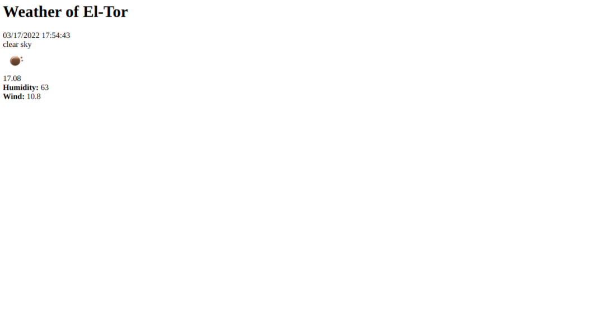
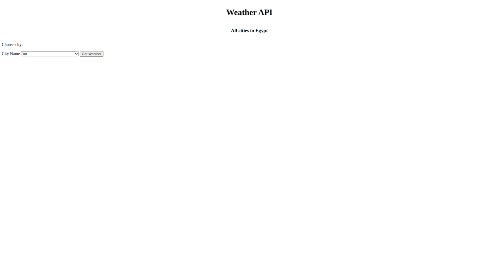

# PHP - openwathermap API  Demo

This is a solution to the [PHP-openweathermap-Demo]

## Table of contents

- [Overview](#overview)
    - [Screenshot](#screenshot)
- [My process](#my-process)
    - [Built with](#built-with)
- [Author](#author)

## Overview

### Screenshot

## My process

### Built with

- Native PHP
- Curl
- Guzzle
- openweathermap API

## Author

- LinkedIn - [Mohamed Eldefrawy](https://www.linkedin.com/in/mohamedeldefrawy/)
